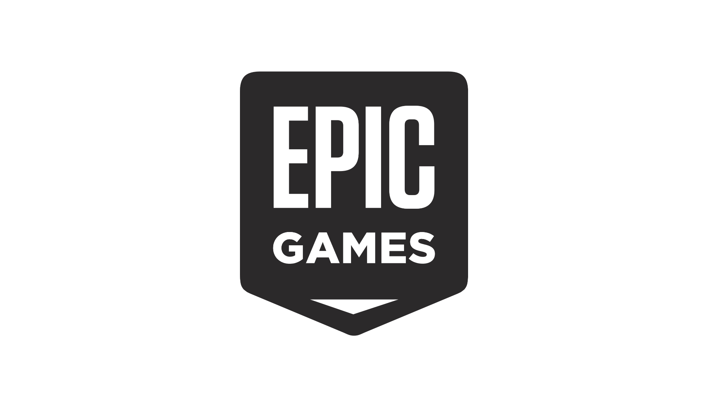

### 👋Opa, eu sou o Caique

-  🎓 Estudando Técnologo de Sistemas para Internet em IF Goiano
-  💻 Aprendendo PHP
# Minhas redes sociais:

<h3>Minhas Redes de jogo</h3>

<h3>Objetivos:</h3>  

- Terminar de desenvolver o jogo Death Impact.

<!--
**Funj13/Funj13** is a ✨ _special_ ✨ repository because its `README.md` (this file) appears on your GitHub profile.

Here are some ideas to get you started:

- 🔭 I’m currently working on ...
- 🌱 I’m currently learning ...
- 👯 I’m looking to collaborate on ...
- 🤔 I’m looking for help with ...
- 💬 Ask me about ...
- 📫 How to reach me: ...
- 😄 Pronouns: ...
- ⚡ Fun fact: ...
-->

